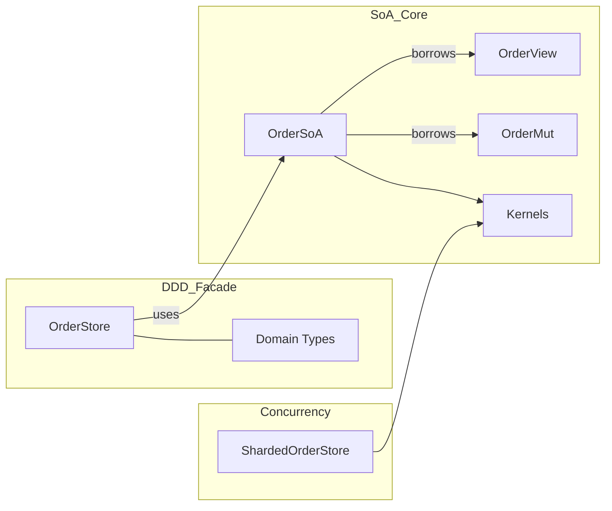

```mermaid
graph LR
  subgraph DDD_Facade
    A[OrderStore]
    B[Domain Types]
  end

  subgraph SoA_Core
    S[OrderSoA]
    V[OrderView]
    M[OrderMut]
    K[Kernels]
  end

  subgraph Concurrency
    SH[ShardedOrderStore]
  end

  A --- B
  A -- uses --> S
  S -- borrows --> V
  S -- borrows --> M
  S --> K
  SH --> K
```
